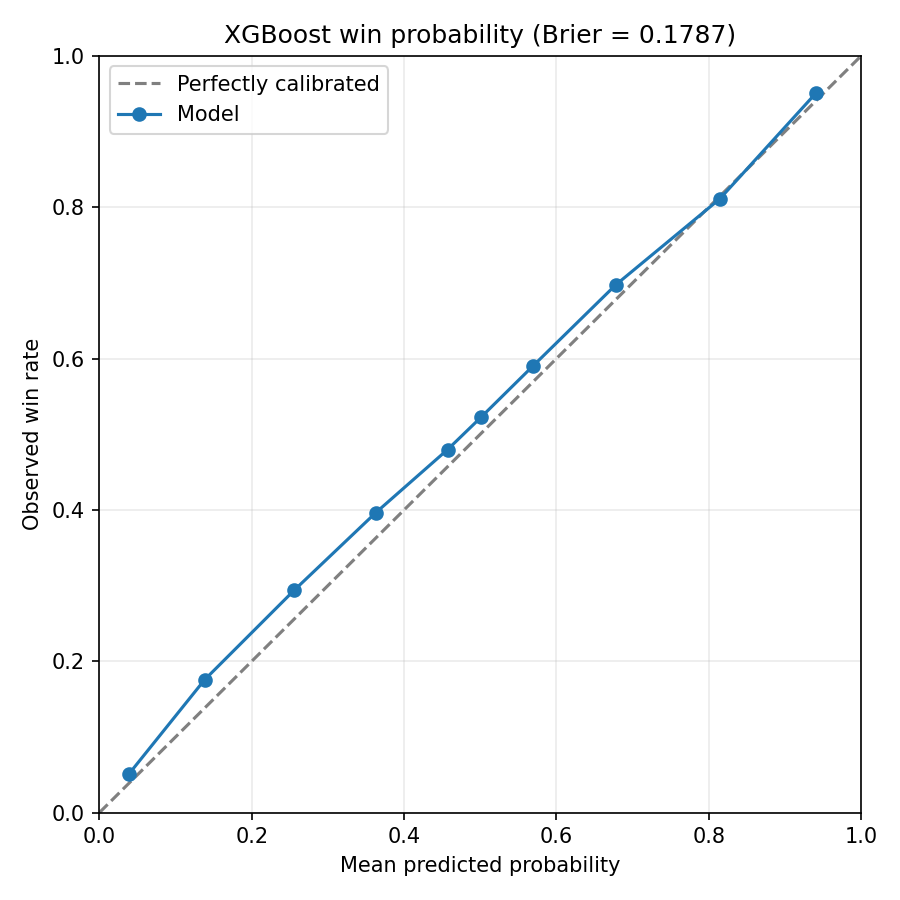
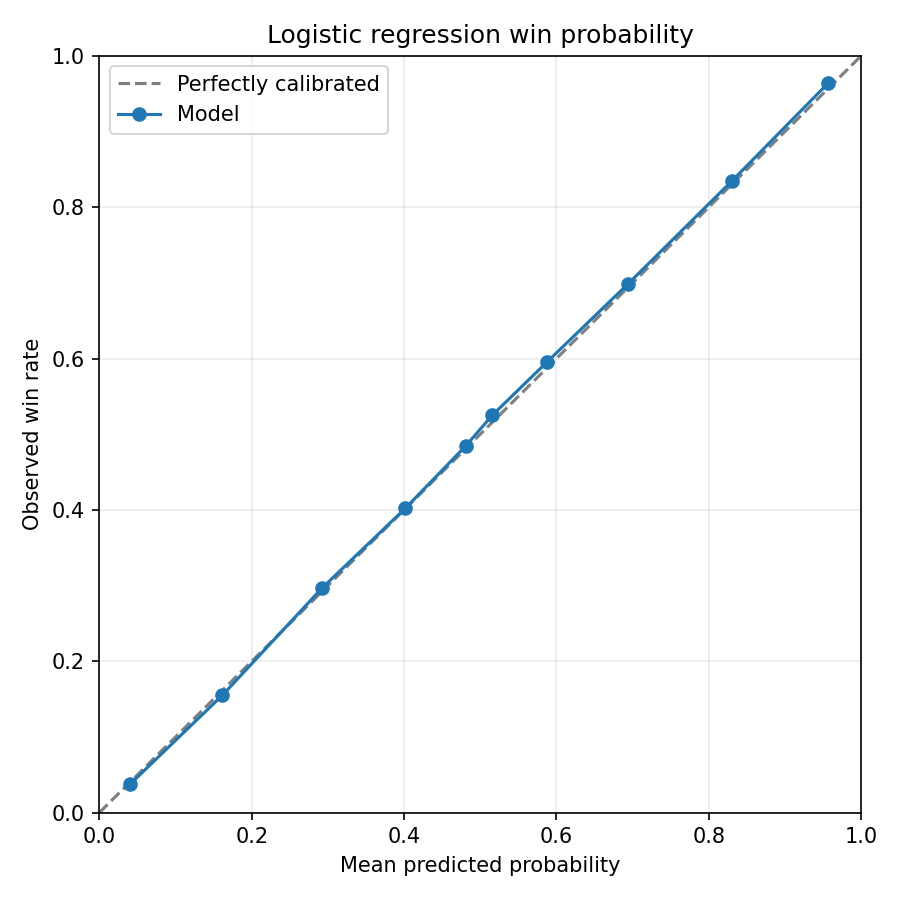
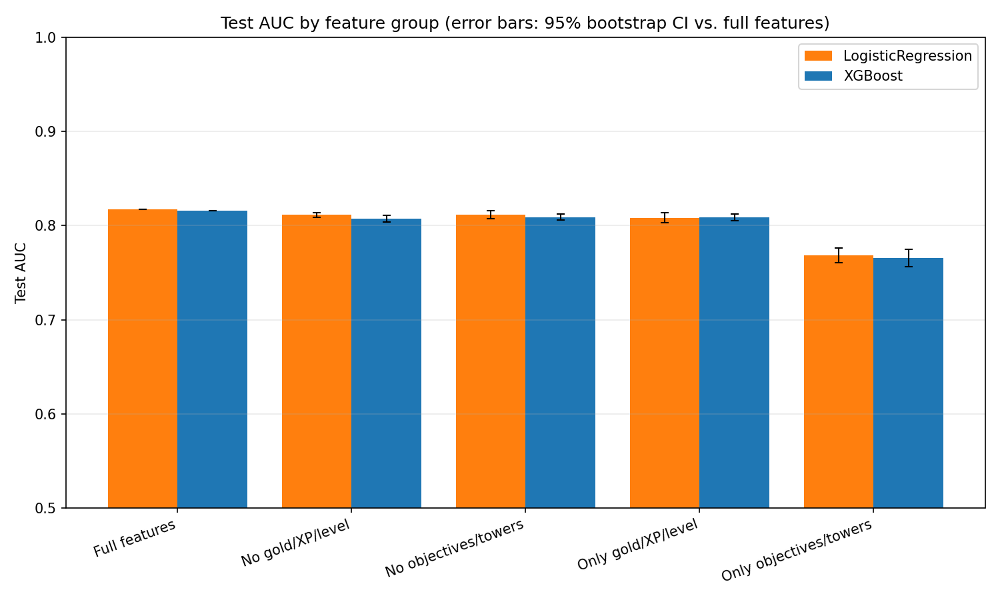
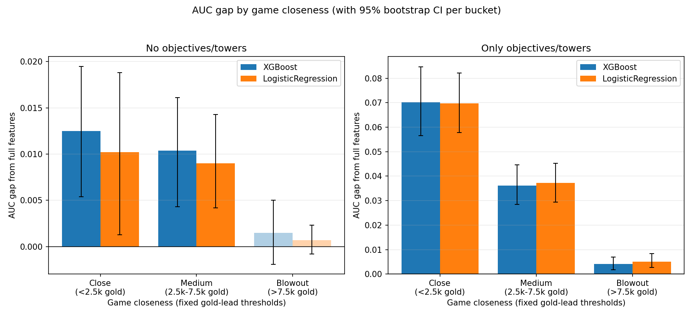
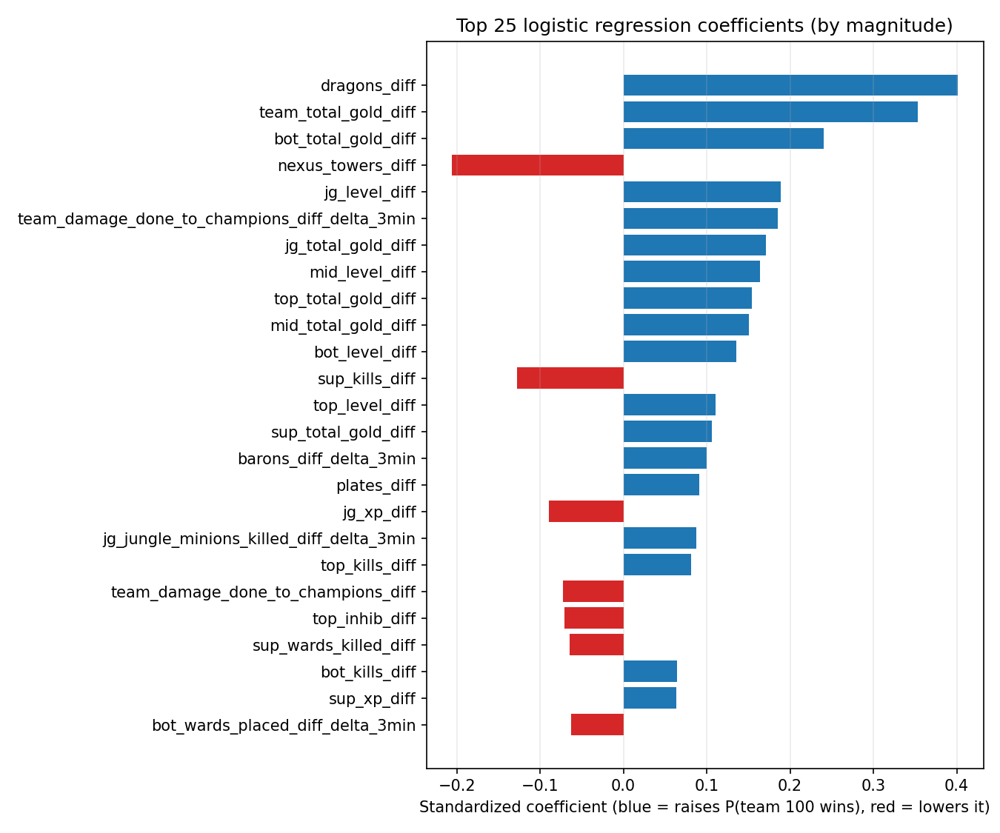
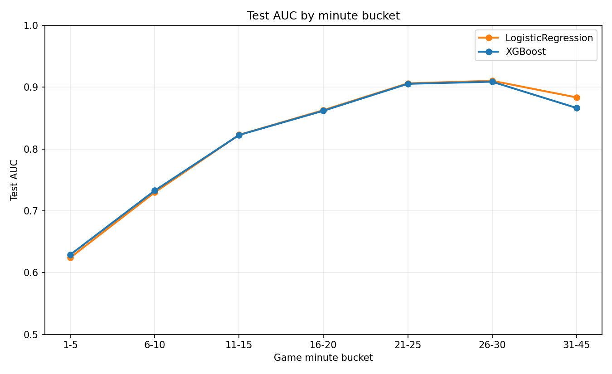
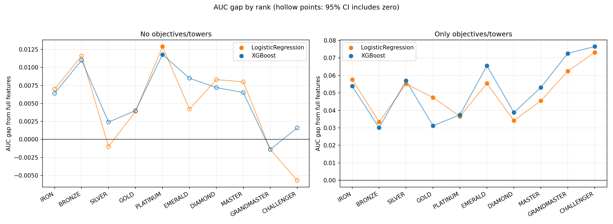

# League of Legends Win Probability Model

A study of whether win probability in League of Legends is explained by economic lead (gold, XP, levels) or whether objective control (dragons, heralds, barons, towers) carries independent predictive value.

A logistic regression baseline and an XGBoost ensemble were trained on 9,596 ranked solo/duo NA matches (295,852 per-minute snapshots, single patch, Iron through Challenger), then evaluated with a feature-ablation study using match-level bootstrapped confidence intervals.

**[Live app](https://jjzhao05-league-of-legends-win-probability-model-app-8g8jtl.streamlit.app/)** · **[Full report (PDF)](report.pdf)**

## Model performance

| Model | AUC | Accuracy | Brier |
|---|---|---|---|
| Logistic Regression | 0.817 | 72.4% | 0.173 |
| XGBoost | 0.816 | 72.3% | 0.174 |

The linear and nonlinear models agree to within 0.001 AUC, indicating the findings below reflect a property of the data rather than an artifact of one model architecture.

 

## Findings

Economy and objectives are largely redundant, but neither is dispensable. Removing either feature group from the full model costs under 1% AUC (bootstrap 95% CIs exclude zero, so the effect is real but small).

| Ablation | XGBoost AUC | Logistic AUC |
|---|---|---|
| Full model | 0.816 | 0.817 |
| Economy only | 0.809 (99% retained) | 0.808 (99% retained) |
| Objectives only | 0.766 (94% retained) | 0.769 (94% retained) |

Economy is the more complete standalone signal, retaining 99% of full-model AUC alone. Objectives alone retain 94%, indicating they are not merely a proxy for economic state.

Objective control's independent value is concentrated in close games. Stratifying by gold-difference magnitude, an objectives-only model retains 89.5% of full-model AUC in close games versus 99.6% in blowouts.

`dragons_diff` is the single most predictive feature in the linear model (coefficient 0.40), ahead of `team_total_gold_diff` (0.35). It also ranks in the top five XGBoost features by split gain.

Predictive power scales with game length, from 0.63 AUC at minutes 1-5 to 0.91 AUC at minutes 26-30, before a slight decline in the 31-45 minute bucket (a smaller, atypical sample of unusually even games).

The effect is strongest at high skill tiers. The objectives-only AUC gap is smallest in Iron/Silver and largest in Grandmaster/Challenger (>7% of full-model AUC), consistent with macro decision-making mattering more once mechanical variance is reduced.

Currently limited to NA (`PLATFORM`/`REGION` are hardcoded in `collect_data.py`).
